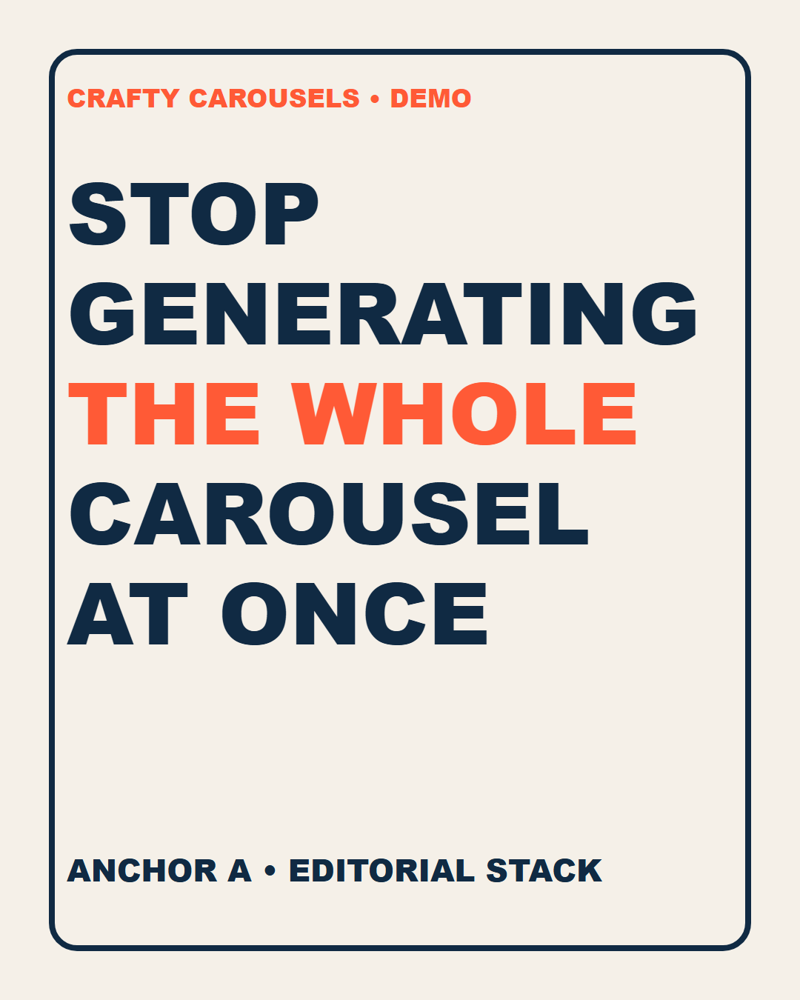
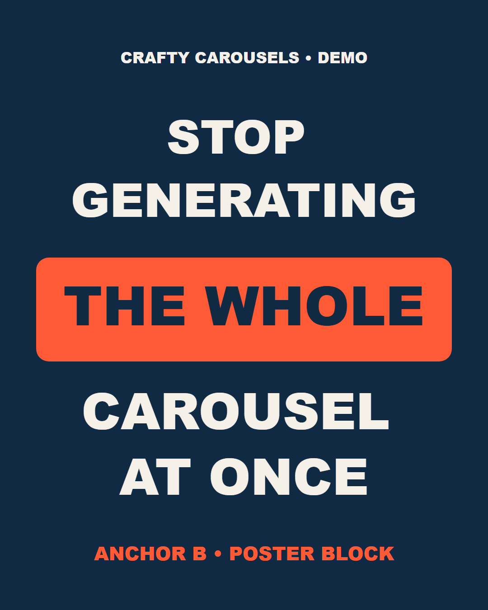
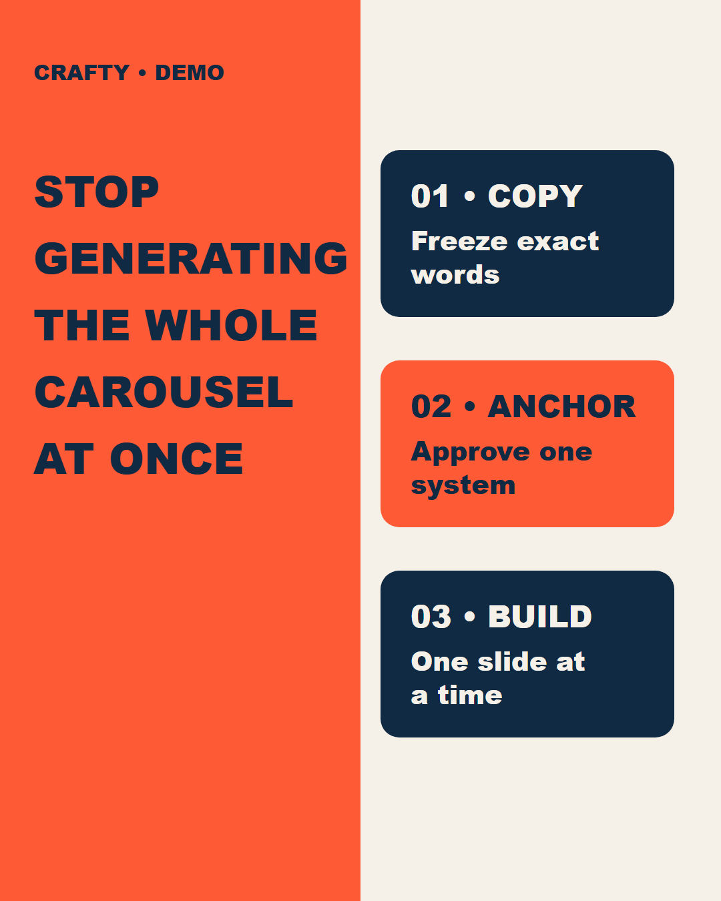

# Crafty Carousels Skill

**A governed carousel production system for ChatGPT and Codex.**

[](https://github.com/plotdevice01/crafty-carousels-skill/releases/latest)
[](https://github.com/plotdevice01/crafty-carousels-skill/actions/workflows/validate.yml)
[](LICENSE)

Crafty Carousels turns one approved idea into a controlled Instagram or LinkedIn carousel package. It handles intake, exact copy, three required cover directions, visual production, mobile QA, rights checks, release approval, and measurement records.

It is designed for repeatable quality. It does not promise virality.

## Public-safe demo

The three covers below use the **same exact copy** but materially different compositions. That is the required anchor test. Color swaps do not count as separate directions.

<table>
  <tr>
    <td width="33%"></td>
    <td width="33%"></td>
    <td width="33%"></td>
  </tr>
  <tr>
    <td align="center"><strong>A: Editorial stack</strong></td>
    <td align="center"><strong>B: Poster block</strong></td>
    <td align="center"><strong>C: System visual</strong></td>
  </tr>
</table>

These are fictional vector mockups built with deterministic text layers. They demonstrate the workflow without publishing client images, claims, or likenesses.

## The production system

```text
Client intake
    ↓
Strategy and exact copy approval
    ↓
Three distinct Slide 1 anchors
    ↓
One approved visual system
    ↓
One slide at a time
    ↓
Mobile, rights, evidence, and release QA
```

The repeating unit is one client carousel run inside an ICM Pipeline. Stable brand controls stay in the client workspace. Each run records its own brief, copy, prompts, approvals, slide files, QA, and release status.

## What the skill enforces

### 1. Client isolation and intake

- One private workspace per client.
- One audience, goal, action, and platform route before production.
- One campaign content class: Business, UGC Creator, or Influencer.
- One hook-research pool: image-carousel-first; video-first adapted to carousel; or both.
- Named workspace owner plus authorized approver.
- Versioned brand, voice, people, asset, claim, and release records.
- Rights status for every logo, font, screenshot, testimonial, photo, and reference.
- Separate permission decisions for organic use and paid use. AI editing and AI likeness generation remain separate too.
- Client media stays in the private workspace. It is never bundled into this public plugin.
- Missing material decisions become `UNKNOWN` or `HOLD`. They are never filled from another client or model memory.

### 2. Copy control

Every run declares one mode before design:

| Mode | Rule |
|---|---|
| `exact-source` | Preserve every approved word and punctuation mark. Do not add hooks, labels, explanations, summaries, or CTA copy. |
| `approved-draft` | Draft from approved evidence, then obtain human approval before image production. |

Additional controls:

- Write the entire carousel before generating slides.
- Freeze approved `copy.md` with SHA-256.
- Stop production if the approved copy hash changes.
- Keep one job and one primary message per slide.
- Make Slide 2 a second hook that gives the reader a reason to continue.
- Make the final value slide the payoff, not a weaker recap.
- Use one CTA tied to the approved campaign goal.
- Run AI Sloppy Copy on slide copy, caption, alt text, and client-facing notes.
- Preserve `Hook -> Value -> CTA` without inventing proof, urgency, keywords, or performance claims.

#### Hook pattern library

The skill retrieves hooks by campaign content class and format fit instead of mixing incompatible creator styles or forcing video-native hooks onto static covers:

| Class | Use when | Library behavior |
|---|---|---|
| Business | The company, practice, product, service, or named expert is the authority | Filters all compatible source records by class and format fit |
| UGC Creator | The content is a relatable demonstration, review, comparison, or experience | Filters all compatible source records by class and format fit |
| Influencer | Personality, story, taste, or audience relationship drives attention | Filters all compatible source records by class and format fit |

The local source library contains 751 source records: 300 paired hook/example records plus 351 categorized records and 100 hook starters. Crafty also embeds 7 script frameworks and 39 CTAs. The operator sees three to five candidates with stable IDs and format fit. It shows examples when the source supplied them. The selected pattern is adapted only with approved client evidence and voice. The databases are offline ideation sources. They do not prove a hook is currently trending or guarantee performance.

### 3. Carousel frameworks

Use the shortest sequence that carries the idea. Slide count is a content decision, not a padding target.

| Framework | Slide jobs |
|---|---|
| Five-slide compact | Hook → Value → Frame → Proof → Action |
| Eight-slide default | Hook → Transition → Tease and value → Payoff → Action |
| Ten-slide conversion | Pattern interrupt → Tension → Structural insight → Application → Action |

Every slide must earn the next swipe.

Choose a format that fits the insight:

- **Comparison:** before and after, or old way and new way.
- **Tutorial:** a process revealed one useful step at a time.
- **Native:** a personal story with an earned lesson.
- **Story arc:** a transformation narrative with a supported payoff.
- **Custom approved:** another recorded structure approved for that run.

### 4. Reference-first anchor workflow

- Choose two to four references.
- Assign one job to each reference, such as composition, typography, color, texture, subject treatment, or photography.
- State what may be borrowed and what must be excluded.
- Supply the exact approved cover copy.
- Generate **exactly three genuinely different compositions**.
- Save all three files and SHA-256 values.
- Review every candidate at full size and approximately 320 pixels wide.
- Select one direction and refine it into the visual anchor.
- Freeze `visual-brief.md` with SHA-256.
- Require human anchor approval before producing the deck.

The system rejects color-only variants and vague “match this style” instructions. It also rejects copied creator marks and full-carousel generation requests.

### 5. Design constraints

| Control | Enforced rule |
|---|---|
| Typography | No more than two font families. Use hierarchy, weight, scale, and spacing instead of typeface variety. |
| Color | No more than three primary colors. Use one background and one text color plus one accent. |
| Visual continuity | One approved thread governs typography and palette. Spacing, image treatment and motif behavior remain fixed. |
| Organic portrait | 1080 × 1440 or 3:4 when the verified route supports it. |
| Paid-compatible portrait | 1080 × 1350 or 4:5 after checking the intended ad product. |
| Safe zone | Keep 180 px clear at the top and bottom. Keep 50 px clear on the left and 120 px on the right. |
| Final files | Separate slides with identical dimensions and correct ordering. No final contact sheet. |

### 6. Mobile readability gate

Readability outranks decoration.

- Inspect every slide at approximately 320 pixels wide.
- Use a wide, heavy, high-x-height sans-serif for the dominant message.
- On 1080 × 1350 slides, start headlines at 68 px. Start supporting copy at 40 px and CTAs at 48 px.
- Use weight 800 or heavier for production text.
- Shorten copy before shrinking type.
- Keep one dominant headline plus no more than two short supporting sentences.
- Reserve a dedicated high-contrast text-safe field before placing the subject.
- Keep text off faces, heads, bodies, hands, and primary objects.
- Never place text on glows, flares, haze, or gradient hotspots.
- Keep the CTA high enough to survive crop and interface overlays.
- Reject any word that requires zooming or squinting. Reject anything that needs a second read.
- Render final wording with a deterministic text layer. Do not trust an image model to typeset production copy.

The default is plain text. Decorative bars and arrows are blocked by default. The same rule applies to fake interfaces, stray symbols and unexplained shapes unless the approved brand system gives them a real function.

### 7. Personal-brand and likeness control

- Prefer an approved real-photo composite when exact identity matters.
- Use GPT Image for the scene or lighting plate. It can also handle backgrounds and other non-identity elements.
- Preserve the approved person's real face and body instead of regenerating identity.
- Record whether the run uses `approved-real-photo-composite`, `approved-ai-likeness`, or `not-applicable`.
- Block synthetic endorsements and unapproved product depictions.
- Track platform and territory terms. Record every other applicable usage limit separately.

### 8. One-slide-at-a-time production

Every slide prompt records:

- dimensions and platform route;
- slide number and narrative role;
- exact text and punctuation;
- approved anchor image;
- job of every additional reference;
- composition and subject;
- fixed palette, typography behavior, margins, numbering, and logo rules;
- excluded elements;
- approved person or likeness asset IDs;
- one-slide-only output requirement.

If one slide fails, fix that slide. Approved slides are not regenerated because one file needs correction.

### 9. QA after every slide

The skill checks:

- exact wording and spelling;
- mobile hierarchy and contrast;
- dimensions and safe placement;
- consistency with the approved anchor;
- distinct visual progression;
- identity fidelity;
- unsupported claims, logos, interfaces, people, or product details;
- unapproved likeness edits or synthetic endorsements;
- accidental watermarks or signatures;
- copied branding;
- brand, legal, cultural, and accessibility fit.

### 10. Governance and release controls

Every material claim is classified as `Verified`, `Client asserted`, `Heuristic`, or `Unknown`.

A run cannot become `release_ready` until:

- strategy and copy approvals are recorded;
- anchor approval is recorded;
- final files match the manifest count and order;
- copy accuracy and visual consistency pass;
- claims and citations pass;
- asset rights and disclosure decisions are recorded;
- depicted people have the required likeness permissions;
- caption and per-slide alt text are complete;
- the live platform route and item limit are recorded with a verification date;
- human release approval is recorded.

Publication, scheduling, delivery, and media buying remain separate authorized actions.

### 11. Measurement framework

The system treats virality as an outcome to test, not a promise. When data is available, it records:

- reach and impressions;
- saves and shares per reached account;
- final-slide or completion rate;
- profile actions and clicks;
- qualified messages or leads;
- revenue tied to the CTA;
- tested hook and cover;
- topic and slide count;
- route and publish time.

Change one major variable per experiment when practical. Preserve the same core content during cover tests.

## What a completed run contains

| File or asset | Purpose |
|---|---|
| `run.json` | Status and hashes plus the platform route. It also records approvals and release state. |
| `copy.md` | Hooks and exact slide copy. It also stores the caption and alt text. |
| `visual-brief.md` | Reference roles and visual exclusions. It also records anchor rules and the selected direction. |
| `prompts.md` | Editable prompt for every generated asset. |
| Separate slide files | Final slides at identical dimensions. |
| `qa.md` | Evidence, rights, accessibility, visual, and platform checks. |
| Client profile versions | Exact brand, voice, people, asset, and claim records used. |

## GPT Image support

Crafty Carousels uses the installed image generation capability for GPT Image 2 or the current approved image model. The skill controls briefs, references, approvals, prompts, hashes, and QA. It does not embed a private API key or lock the team to an obsolete model wrapper.

## Install for a team

### Codex or ChatGPT desktop

```powershell
codex plugin marketplace add plotdevice01/crafty-carousels-skill --ref v0.6.0
codex plugin add crafty-carousels@crafty-carousels-skill
```

Restart the app or begin a new task, then invoke `$crafty-carousels`.

Pinning the release tag keeps every teammate on the same ruleset. This public repository is a team distribution source. It is not automatically a listing in OpenAI's universal plugin directory.

## Required companion

Final copy and release require the AI Sloppy Copy plugin. If it is missing, Crafty Carousels may prepare internal drafts but must block final copy approval and release.

Chief of Staff is optional. When installed, Chief can coordinate intake and stage status. It can also coordinate approvals and client handoff. Crafty Carousels works by itself through its saved workspace contracts.

## Start a client workspace

```powershell
python plugins/crafty-carousels/skills/crafty-carousels/scripts/new_carousel_project.py init `
  --client-name "Example Co" `
  --owner "Content Lead" `
  --output "C:\work\example-carousel"
```

The skill asks one unanswered blocking question at a time. Actual client media belongs in the private `_shared/media/` folder created by the script.

## Validate and build

```powershell
python scripts/validate_repository.py
python scripts/build_release.py
```

The release builder creates a deterministic plugin ZIP and SHA-256 receipt in `dist/`.

## Offline source of truth

The full operating workflow is stored in the plugin. Production does not fetch Novitckii or any other instructional page at runtime. [`references/sources.md`](plugins/crafty-carousels/skills/crafty-carousels/references/sources.md) retains provenance links for later review.

Mutable platform limits still require release-time verification. The repository summarizes reusable methods from referenced sources. It does not redistribute creator assets or source pages. Client files also remain private.

## Versioning

- **Release tag:** the package teammates install, such as `v0.6.0`.
- **Plugin manifest:** host-facing package metadata, such as `0.6.0`.
- **Skill workflow:** the production contract and client workspace templates inside that release.

See [CHANGELOG.md](CHANGELOG.md) for release history.
